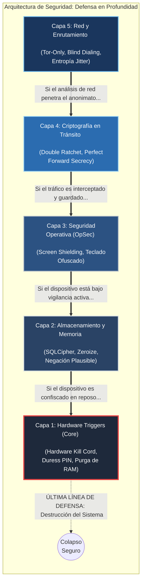
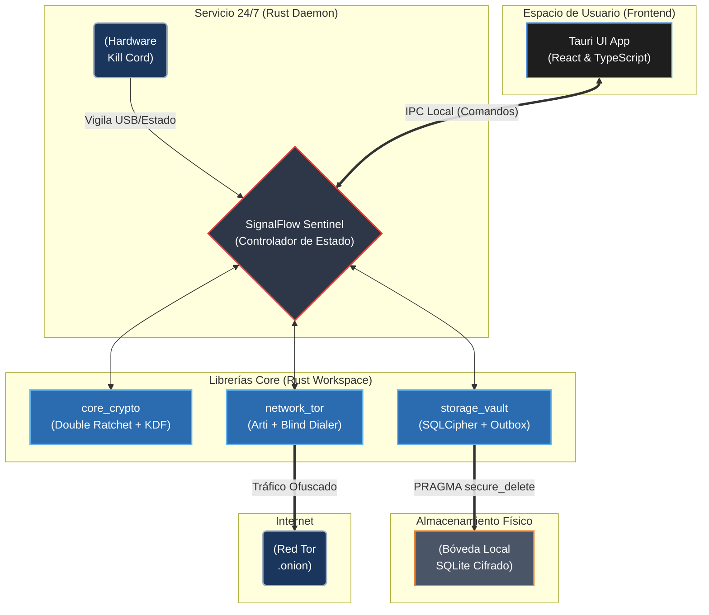

# SignalFlow: Visión General de la Arquitectura (Architecture Overview)

SignalFlow implementa un modelo de **Defensa en Profundidad (Defense-in-Depth)** estructurado en 5 capas concéntricas. Esta arquitectura asume que ninguna capa individual es infalible; si el anonimato de red se rompe, la criptografía protege el mensaje. Si la criptografía es extraída, el almacenamiento local destruye la evidencia. Si el dispositivo físico es comprometido activamente, el hardware colapsa el sistema.

## 1. El Modelo de 5 Capas (Defense-in-Depth)

La infraestructura lógica de SignalFlow se divide en las siguientes barreras defensivas:

- **[Capa 5 - Red y Enrutamiento](02_network_and_routing.md):** Mitiga el análisis de tráfico y el rastreo de IPs mediante una red 100% P2P sobre Tor, _Blind Dialing_ y asincronía local (_Store-and-Forward_).
- **[Capa 4 - Criptografía en Tránsito](03_cryptography.md):** Mitiga la intercepción de red mediante cifrado asíncrono _Double Ratchet_, garantizando _Perfect Forward Secrecy_ (PFS).
- **[Capa 3 - Seguridad Operativa (OpSec)](04_application_security.md):** Mitiga la vigilancia del sistema operativo host mediante evasión de capturas de pantalla (_Screen Shielding_) y teclados virtuales ofuscados.
- **[Capa 2 - Almacenamiento y Memoria](05_storage_and_memory.md):** Mitiga extracciones forenses en reposo mediante bases de datos efímeras cifradas (SQLCipher), purga de RAM (`zeroize`) y Negación Plausible.
- **[Capa 1 - Hardware Triggers](06_hardware_triggers.md):** Mitiga la coerción física y el _Live-Extraction_ mediante Pines de Coacción (_Duress PIN_) y Cordones de Desconexión de Hardware (_Hardware Kill Cord_).

---

## 2. Arquitectura de Sistemas y Topología de Código

Para lograr un aislamiento estricto y permitir que las defensas físicas funcionen 24/7, SignalFlow rechaza el modelo de aplicación tradicional de un solo hilo. El ecosistema está diseñado como un **Monorepo (Cargo Workspace)** que compila en dos procesos independientes:

### A. SignalFlow Sentinel (Demonio de Fondo)

El núcleo crítico del sistema. Es un binario sin interfaz gráfica (Headless) escrito en Rust puro que se ejecuta como un servicio de sistema (similar a un motor anticheat).

- **Responsabilidades:** Administra la red Tor, maneja la criptografía, vigila los puertos USB para el _Kill Cord_ y mantiene la base de datos cifrada abierta en memoria.

### B. SignalFlow UI (Frontend Tauri)

El cliente visual interactivo. Es una aplicación web encapsulada (TypeScript/React) que se comunica localmente con el _Sentinel Daemon_ a través de IPC (Inter-Process Communication) autenticado.

- **Responsabilidades:** Renderizar la interfaz de chat, recibir el input del usuario y ofrecer la experiencia de edición para la Negación Plausible. **No posee acceso directo a la memoria criptográfica.**

---

## 3. Diagrama de Arquitectura de Componentes

El siguiente diagrama ilustra el flujo de datos y la separación de responsabilidades a través de las librerías (`crates`) de nuestro Workspace en Rust:

