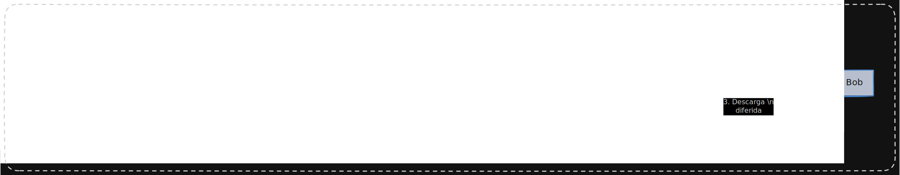

# Capa 5: Enrutamiento Dinámico y Anonimato de Red (Tor-Only P2P)

Esta capa constituye la frontera exterior de la arquitectura de SignalFlow. Asume un entorno de red inherentemente hostil, donde los Proveedores de Servicios de Internet (ISPs), agencias gubernamentales o nodos maliciosos monitorizan activamente el tráfico.

A diferencia de las arquitecturas comerciales que buscan baja latencia mediante UDP/WebRTC (lo cual introduce riesgos críticos de fugas de IP a través de _ICE Candidates_), SignalFlow prioriza matemáticamente la **invisibilidad de los metadatos**, aceptando la asincronía y la latencia como un costo necesario para la seguridad operativa (OpSec).

## 1. Topología de Red: P2P Estricto y Soberanía de Infraestructura

Para resolver el dilema del mapeo de red (Sybil Attacks) y evitar la dependencia de infraestructuras centralizadas o _Swarms_ de terceros, SignalFlow implementa una arquitectura de Soberanía de Infraestructura. Todo el tráfico fluye exclusivamente a través de la darknet utilizando el protocolo de Tor.

### 1.1. Conexión Directa y Marcado Ciego (Blind Dialing)

El sistema no utiliza servidores de señalización para descubrir IPs ni mantiene un "estado de conexión" (presencia) público.

- **Tor Hidden Services (v3):** Cada cliente de SignalFlow integra un demonio Tor (`arti-client`) que levanta un servicio oculto (`.onion`) anclado estrictamente a `127.0.0.1`.
- **Blind Dialing:** Para enviar un mensaje, el cliente de Alice no verifica el estado de Bob. Simplemente intenta abrir un circuito Tor cifrado hacia la dirección `.onion` de Bob. Si Bob está offline, la conexión falla silenciosamente sin alertar a la red. Si está online, el circuito se establece y los datos fluyen de extremo a extremo.

### 1.2. Asincronía Local (Store-and-Forward)

SignalFlow está diseñado para operar en entornos de conectividad intermitente.

- Si el destinatario está offline, el mensaje no se pierde ni se envía a un servidor ajeno. El _payload_ se cifra inmediatamente con la llave _Double Ratchet_ del destinatario y se encola en la base de datos local (Bandeja de Salida Ciega).
- Un proceso en segundo plano (Background Worker) reintenta la conexión periódicamente hasta que el envío es exitoso, momento en el cual el mensaje se purga del almacenamiento local.

### 1.3. Modo Paranoia: Nodos Relevo Auto-hospedados (Self-Hosted Relays)

Para usuarios que requieren alta disponibilidad sin comprometer su ubicación física manteniendo su dispositivo primario encendido, SignalFlow soporta infraestructura delegada propia.

- Un usuario puede desplegar un demonio de SignalFlow en modo "Relay" en hardware propio (ej. una Raspberry Pi en una ubicación segura).
- Este nodo actúa como un buzón ciego personal 24/7. Si Alice no puede conectar directamente al móvil de Bob, la aplicación enruta automáticamente el paquete cifrado al _Self-Hosted Relay_ de Bob, manteniendo la filosofía _Zero-Trust_ al no requerir confianza en servidores administrados por extraños.

## 2. Contramedidas de Análisis de Tráfico (Traffic Analysis Defenses)

Incluso con el enrutamiento anonimizado, un adversario pasivo a nivel de ISP podría utilizar análisis estadístico para deducir patrones de comportamiento. Para mitigar los ataques de inferencia y correlación, SignalFlow implementa estrictas reglas de modelado de red:

- **Identidades Efímeras (Key-Based Routing):** SignalFlow erradica la dependencia de identificadores del mundo real (como números de teléfono o correos). El enrutamiento se basa exclusivamente en direcciones `.onion` derivadas de llaves públicas Ed25519. Si una identidad se ve comprometida operativamente, el usuario puede "quemar" la llave y generar una identidad nueva e inconexa en milisegundos.
- **Traffic Padding Estricto (Relleno de Paquetes):** El tamaño de los paquetes es uniforme. Todos los mensajes se normalizan a un tamaño de bloque fijo (ej. 8 KB). Si el texto es menor a este tamaño, el cliente inyecta bytes aleatorios (ruido criptográfico) antes de aplicar el cifrado. Para un observador externo, todos los paquetes transmitidos son cajas negras idénticas en peso.
- **Jitter en Reintentos (Ofuscación Temporal):** Las reconexiones para enviar mensajes encolados no ocurren en intervalos fijos predecibles (ej. cada 60.00 segundos). El cliente inyecta _Jitter_ (entropía temporal) en cada intento, variando los tiempos de espera de forma aleatoria para destruir cualquier firma de automatización que un atacante intente perfilar.

---

> **Nota Arquitectónica:** Al unificar la red bajo un modelo Tor-Only, la superficie de ataque se reduce drásticamente. Cualquier intento de vulnerar la red requiere romper el protocolo de enrutamiento cebolla, mientras que la confidencialidad absoluta del contenido queda respaldada por la **Capa 4 (Criptografía)**.
